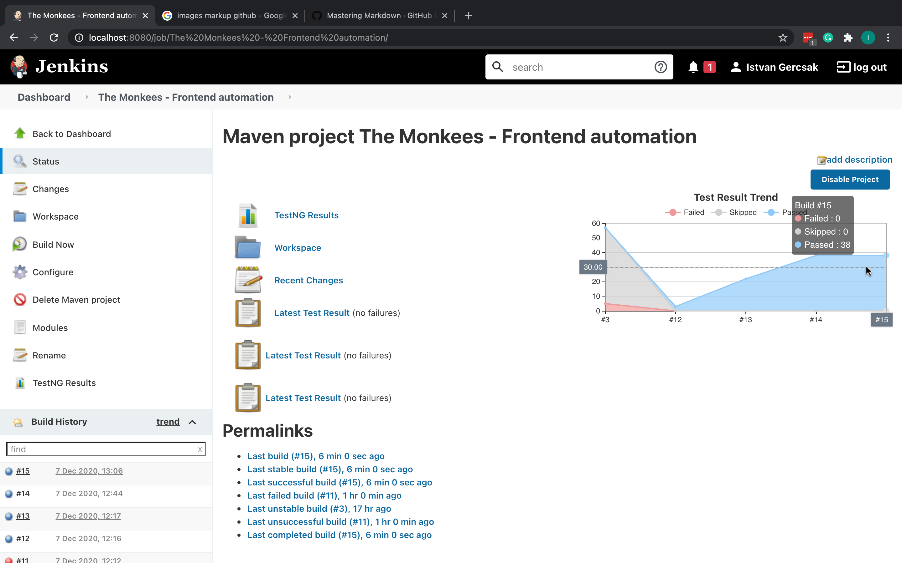

# Test automation mini project

I created a UI test automation framework for one of my website called The Monkees official website.
The framework contains:
- UI Automation with Selenium WebDriver in order to check UI elements on the website
- Logging function
- Reporting function

# Website

Website link [here](https://istvangercsak.github.io/TheMonkees/)

# Used technologies

- Java (JDK 14)
- Selenium WebDriver
    - UI automation API tool in order to control website interactions
    - Used browser
        - Chrome browser
        - Mozilla Firefox browser
- TestNG
    - Testing framework
- Maven
    - Project building automation tool

# How to use it

- Fork the git repository
- Install the dependencies with the help of the POM
- Right click on one the testNG runner file
- Log will create automatically

# CI integration with jenkins

- I created a local Jenkins server
- I created a job for my test
- I prepare my project to run my test on Jenkins as follows:
```xml
 <build>
        <plugins>
            <plugin>
                <groupId>org.apache.maven.plugins</groupId>
                <artifactId>maven-surefire-plugin</artifactId>
                <version>3.0.0-M5</version>
                <configuration>
                    <suiteXmlFiles>
                        <suiteXmlFile>testNG_ALL.xml</suiteXmlFile>
                    </suiteXmlFiles>
                </configuration>
            </plugin>
            <plugin>
                <artifactId>maven-compiler-plugin</artifactId>
                <configuration>
                    <source>1.8</source>
                    <target>1.8</target>
                </configuration>
            </plugin>
        </plugins>
    </build>
```

- I configure the job to run the project with "maven test" command from the test folder.
For this I created a Pre Step with the following command:

```shell script
cd /Users/istvangercsak/IdeaProjects/Test
mvn test
```

# Reporting and Logging 

## Reporting

- Built in Jenkins and testNG reporting function:



## Logging
- log4j logging function
    - It will expand the log file in the "../logs/log.log" file
    - You can see the actual run details in the Jenkins job in each run